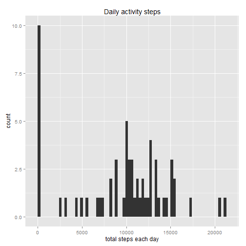
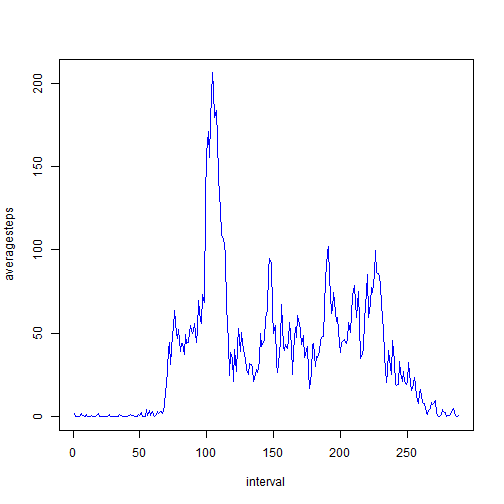
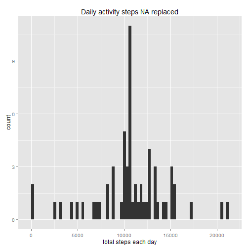
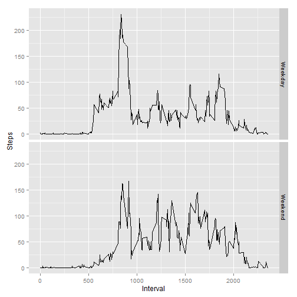

2
# Peer Assessment 1


Loading and preprocessing:


```r
  unzip("repdata-data-activity.zip")
  ## This first line will likely take a few seconds. Be patient!
  activity <- read.csv("activity.csv")
```

### What is mean total number of steps taken per day?


```r
steps<-tapply(activity$steps, activity$date, FUN=sum, na.rm=TRUE)
q<-qplot(steps,  binwidth=300, xlab="total steps each day" , main="Daily activity steps")
print(q)
```

 

Note: Histogram plot is for quantitative representation, bar chart is for categorical representation.

### Mean and median total number of steps taken per day


```r
mean(steps, na.rm=TRUE)
```

```
mean median [1] 9354.23
```

```r
median(steps, na.rm=TRUE)
```

```
mean median [1] 10395
```
### What is the average daily activity pattern?
  Make a time series plot (i.e. type = "l") of the 5-minute interval (x-axis) 
  and the average number of steps taken, averaged across all days (y-axis)


```r
average<-aggregate(x=list(steps = activity$steps), by=list(interval = activity$interval), FUN=mean, na.rm=TRUE)
plot.ts(average$steps , xlab="interval" , ylab="averagesteps" , col="blue")
```

 

### Which 5-minute interval, on average across all the days in the dataset, contains the maximum number of steps?


```r
average[which.max(average$steps),]
```

```
##     interval    steps
## 104      835 206.1698
```

## Imputing missing values

### Calculate and report the total number of missing values in the dataset 

```r
count(is.na(activity$steps))
```

```
##       x  freq
## 1 FALSE 15264
## 2  TRUE  2304
```
### Function to replace NA

```r
replaceNA<-function(step, interval ){
  if(is.na(step)){
    
    
    return (average$steps[average$interval == interval])
    
  }
  return (step)
}
```

### Create a new dataset that is equal to the original dataset but with the missing data filled in.

```r
activity_NaReplaced <-activity
activity_NaReplaced$steps<- mapply(replaceNA, activity$steps, activity$interval  )
```
### total number of steps taken each day

```r
steps_NAReplaced<-tapply(activity_NaReplaced$steps, activity_NaReplaced$date, FUN=sum, na.rm=TRUE)
q<-qplot(steps_NAReplaced,  binwidth=300, xlab="total steps each day" , main="Daily activity steps NA replaced")
print(q)
```

 
##### Since NA value is replaced by average value the step counts are increased.

#### Mean and median total number of steps taken per day

```r
mean(steps_NAReplaced, na.rm=TRUE)
```

```
## [1] 10766.19
```

```r
median(steps_NAReplaced, na.rm=TRUE)
```

```
## [1] 10766.19
```
### Are there differences in activity patterns between weekdays and weekends?


```r
activity_NaReplaced$day <- strftime(activity_NaReplaced$date,'%A')
activity_NaReplaced$day <- revalue(activity_NaReplaced$day, c("Sunday"="Weekend", "Monday"="Weekday" , "Tuesday" = "Weekday",  "Wednesday"="Weekday" , "Thursday"="Weekday" , "Friday"="Weekday" , "Saturday"="Weekend" ))
averageNAReplaced<-aggregate(steps ~interval +day, data = activity_NaReplaced ,mean)

ggplot(averageNAReplaced, aes(interval, steps))+geom_line()+facet_grid(day ~.)+xlab("Interval")+ylab("Steps")
```

 

#### Analysis: Morning activities are more in weekdays. But in weekends activities persist throughout the day.


